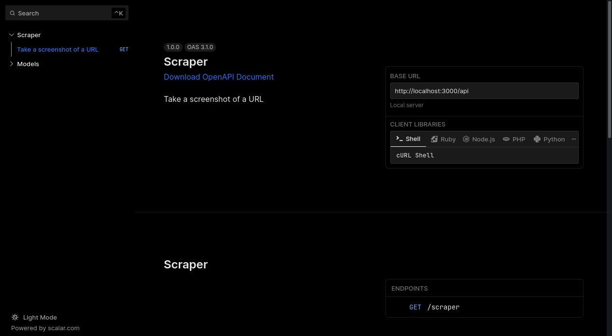
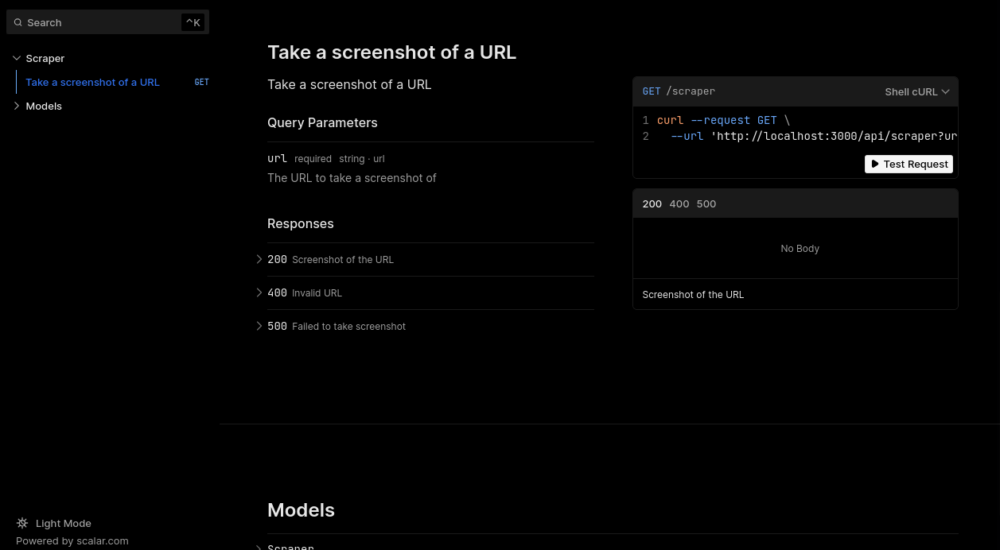
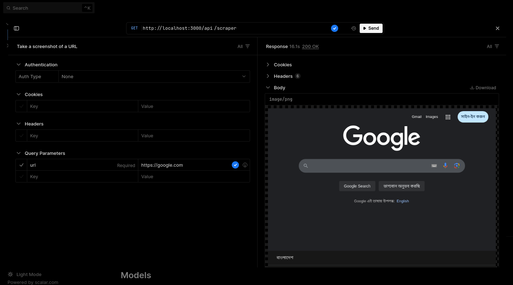

# Screenshot API

This is a simple API that takes a screenshot of a given URL and returns it as a PNG image.

## API Reference

You can view the API reference [here](http://localhost:3000/reference).

## Setup

1. Install dependencies: `pnpm i`
2. Run the development server: `pnpm dev`

## Screenshots

